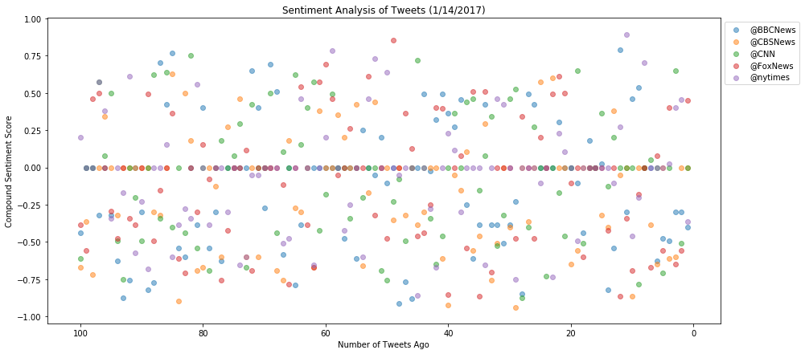
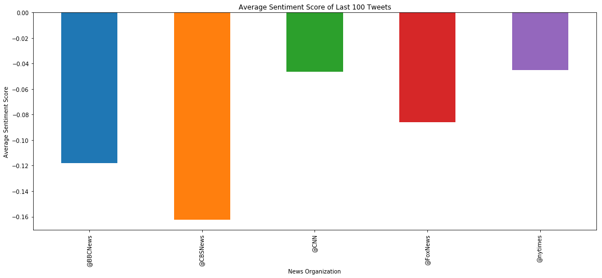

# Twitter Sentiment Analysis


In this demonstration, i'll create a Python script to perform a sentiment analysis of the Twitter activity of various news oulets, and to present the findings visually.

The goal will be to provide a visualized summary of the sentiments expressed in Tweets sent out by the following news organizations: 
- BBC
- CBS 
- CNN 
- Fox
- New York Times

## Libraries

In order to determine the sentiment of news organization tweets, we will use two libraries: VADER, and Tweepy.

VADER (Valence Aware Dictionary and sEntiment Reasoner) is a Python library that allows for sentiment analysis of text. It works by assigning a sentiment to each word, symbol, and emoticon in common parlance. By adding up the sentiment of each word in a passage, it can estimate the sentiment of the passage. The sentiment ranges from -1 (extremely negative) to 1 (extremely positive). It is "specifically attuned to sentiments expressed in social media, and works well on texts from other domains". The library can be found [here](https://github.com/cjhutto/vaderSentiment).

Tweepy is a wrapper for the twitter API, and will make it easier to interact with twitter data. Library and docs can be found [here](http://www.tweepy.org/).

You will also need to acquire an API key from Twitter [here](https://apps.twitter.com/).

## Methodology

1. Make a list of the above news organization's Twitter handles
2. Create a loop to iterate over Twitter handles, return 100 most recent tweets for each, and store in a dataframe
3. Plot a scatterplot of tweet sentiment over time
4. Plot a bar graph of average tweet sentiment over the last 100 tweets for each news organization
5. Put all data, including text of each tweet in a dataframe and export as CSV for storage

### Dependencies


```python
import tweepy
import json
import numpy as np
import pandas as pd
import matplotlib.pyplot as plt
```

### Set Up VADER and Tweepy


```python
# Import and Initialize Sentiment Analyzer
from vaderSentiment.vaderSentiment import SentimentIntensityAnalyzer
analyzer = SentimentIntensityAnalyzer()
```


```python
# Twitter API Keys
consumer_key = "TWYIUgoYgwoHwef9s0eJGzWfe"
consumer_secret = "rgfSOHf0nSJUfNBNbno1jeoQH3yiEmN5S3zAb03xaFPorCTQPW"
access_token = "917817936739409920-w7WLJOSquIknp9QIAyGqf9PTBnoZpuI"
access_token_secret = "jIvGz1yfvgtBEOvBi0cmZTKlkmZ4m9M2qeaH46NLhAWEz"
```


```python
# Setup Tweepy API Authentication
auth = tweepy.OAuthHandler(consumer_key, consumer_secret)
auth.set_access_token(access_token, access_token_secret)
api = tweepy.API(auth)
#, parser=tweepy.parsers.JSONParser()
```

### Retrieve Tweets, Analyze Sentiment, and Store Data


```python
# Set up empty dataframe
df = pd.DataFrame({"@BBCNews":'',
                   "@CBSNews":'',
                   "@CNN":'',
                   "@FoxNews":'',
                   "@nytimes":''}, index=[0])
df.head()
```


<div>
<style scoped>
    .dataframe tbody tr th:only-of-type {
        vertical-align: middle;
    }

    .dataframe tbody tr th {
        vertical-align: top;
    }

    .dataframe thead th {
        text-align: right;
    }
</style>
<table border="1" class="dataframe">
  <thead>
    <tr style="text-align: right;">
      <th></th>
      <th>@BBCNews</th>
      <th>@CBSNews</th>
      <th>@CNN</th>
      <th>@FoxNews</th>
      <th>@nytimes</th>
    </tr>
  </thead>
  <tbody>
    <tr>
      <th>0</th>
      <td></td>
      <td></td>
      <td></td>
      <td></td>
      <td></td>
    </tr>
  </tbody>
</table>
</div>


```python
# Target User Accounts
target_user = ("@BBCNews", "@CBSNews", "@CNN", "@FoxNews", "@nytimes")
```


```python
#comp = api.user_timeline(id='maxkparry')
```


```python
# Loop through each user
for user in target_user:
    counter = 0
    # Loop through 100 tweets
    for status in tweepy.Cursor(api.user_timeline, id=user).items(100):
        # Extract text
        text = status.text
        # Run Vader Analysis on each tweet
        compound = analyzer.polarity_scores(text)["compound"]
        
        # Add each value to the dataframe
        df.set_value(counter, user, compound)
        # Increment counter
        counter = counter + 1
 
```

    /anaconda/lib/python3.6/site-packages/ipykernel_launcher.py:12: FutureWarning: set_value is deprecated and will be removed in a future release. Please use .at[] or .iat[] accessors instead
      if sys.path[0] == '':


```python
df.head()
```


<div>
<style scoped>
    .dataframe tbody tr th:only-of-type {
        vertical-align: middle;
    }

    .dataframe tbody tr th {
        vertical-align: top;
    }

    .dataframe thead th {
        text-align: right;
    }
</style>
<table border="1" class="dataframe">
  <thead>
    <tr style="text-align: right;">
      <th></th>
      <th>@BBCNews</th>
      <th>@CBSNews</th>
      <th>@CNN</th>
      <th>@FoxNews</th>
      <th>@nytimes</th>
    </tr>
  </thead>
  <tbody>
    <tr>
      <th>0</th>
      <td>-0.4391</td>
      <td>-0.6705</td>
      <td>-0.6124</td>
      <td>-0.3818</td>
      <td>0.2023</td>
    </tr>
    <tr>
      <th>1</th>
      <td>0</td>
      <td>-0.3612</td>
      <td>0</td>
      <td>-0.5574</td>
      <td>0</td>
    </tr>
    <tr>
      <th>2</th>
      <td>0</td>
      <td>-0.7184</td>
      <td>0</td>
      <td>0.4588</td>
      <td>0</td>
    </tr>
    <tr>
      <th>3</th>
      <td>-0.3182</td>
      <td>0</td>
      <td>0.5719</td>
      <td>0.4973</td>
      <td>0.5719</td>
    </tr>
    <tr>
      <th>4</th>
      <td>0</td>
      <td>0.34</td>
      <td>0.0772</td>
      <td>0</td>
      <td>0.3818</td>
    </tr>
  </tbody>
</table>
</div>


### Plotting Sentiment


```python
x = np.arange(100, 0, -1)
plt.figure(figsize=(15, 7))
a = plt.scatter(x, df['@BBCNews'], alpha=0.5)
b = plt.scatter(x, df['@CBSNews'], alpha=0.5)
c = plt.scatter(x, df['@CNN'], alpha=0.5)
d = plt.scatter(x, df['@FoxNews'], alpha=0.5)
e = plt.scatter(x, df['@nytimes'], alpha=0.5)
plt.title('Sentiment Analysis of Tweets (1/14/2017)')
plt.xlabel('Number of Tweets Ago')
plt.ylabel('Compound Sentiment Score')
plt.gca().invert_xaxis()
plt.legend((a,b,c,d,e),('@BBCNews', '@CBSNews','@CNN', '@FoxNews', '@nytimes'),numpoints=1, loc='upper right', ncol=1, fontsize=8)
lgd = plt.legend(bbox_to_anchor=(1, 1))
plt.savefig('output/Sentiment_Scatter.png', bbox_extra_artists=(lgd,), bbox_inches='tight')
plt.show()
```





```python
df2 = df.mean()
```


```python
df2.head()
```


    @BBCNews   -0.118099
    @CBSNews   -0.162277
    @CNN       -0.046518
    @FoxNews   -0.086077
    @nytimes   -0.044944
    dtype: float64


```python
plt.figure(figsize=(15, 7))
df2.plot(kind='bar')
plt.title('Average Sentiment Score of Last 100 Tweets')
plt.xlabel('News Organization')
plt.ylabel('Average Sentiment Score')
plt.savefig('output/Average_Sentiment.png')
plt.tight_layout()
plt.show()
```





### Calling API and Storing Comprehensive Data


```python
df3 = pd.DataFrame({"News_Source":'',
                    "Positive_Score":'',
                    "Negative_Score":'',
                    "Neutral_Score":'',
                    "Compound_Score":'',
                    "Tweets_Ago":'',
                    "Tweet_Text":'',
                    "Tweet_Date"}, index=[0])
```


```python
# Target User Accounts
target_user = ("@BBCNews", "@CBSNews", "@CNN", "@FoxNews", "@nytimes")
```


```python
# Loop through each user
counter = 0
for user in target_user:
    incrementer = 1
    # Loop through 100 tweets
    for status in tweepy.Cursor(api.user_timeline, id=user).items(100):
        # Extract text
        text = status.text
        date = status.created_at
        # Run Vader Analysis on each tweet
        positive = analyzer.polarity_scores(text)["pos"]
        negative = analyzer.polarity_scores(text)["neg"]
        neutral = analyzer.polarity_scores(text)["neu"]
        compound = analyzer.polarity_scores(text)["compound"]
        
        
        # Add each value to the dataframe
        df3.set_value(counter, "News_Source", user)
        df3.set_value(counter, "Positive_Score", positive)
        df3.set_value(counter, "Negative_Score", negative)
        df3.set_value(counter, "Neutral_Score", neutral)
        df3.set_value(counter, "Compound_Score", compound)
        df3.set_value(counter, "Tweets_Ago", incrementer)
        df3.set_value(counter, "Tweet_Text", text)
        df3.set_value(counter, "Tweet_Date", date)
        
        
        # Increment counter
        counter = counter + 1
        incrementer = incrementer + 1
```

    /anaconda/lib/python3.6/site-packages/ipykernel_launcher.py:17: FutureWarning: set_value is deprecated and will be removed in a future release. Please use .at[] or .iat[] accessors instead
    /anaconda/lib/python3.6/site-packages/ipykernel_launcher.py:18: FutureWarning: set_value is deprecated and will be removed in a future release. Please use .at[] or .iat[] accessors instead
    /anaconda/lib/python3.6/site-packages/ipykernel_launcher.py:19: FutureWarning: set_value is deprecated and will be removed in a future release. Please use .at[] or .iat[] accessors instead
    /anaconda/lib/python3.6/site-packages/ipykernel_launcher.py:20: FutureWarning: set_value is deprecated and will be removed in a future release. Please use .at[] or .iat[] accessors instead
    /anaconda/lib/python3.6/site-packages/ipykernel_launcher.py:21: FutureWarning: set_value is deprecated and will be removed in a future release. Please use .at[] or .iat[] accessors instead
    /anaconda/lib/python3.6/site-packages/ipykernel_launcher.py:22: FutureWarning: set_value is deprecated and will be removed in a future release. Please use .at[] or .iat[] accessors instead
    /anaconda/lib/python3.6/site-packages/ipykernel_launcher.py:23: FutureWarning: set_value is deprecated and will be removed in a future release. Please use .at[] or .iat[] accessors instead


```python
df3.head(500)
```


<div>
<style scoped>
    .dataframe tbody tr th:only-of-type {
        vertical-align: middle;
    }

    .dataframe tbody tr th {
        vertical-align: top;
    }

    .dataframe thead th {
        text-align: right;
    }
</style>
<table border="1" class="dataframe">
  <thead>
    <tr style="text-align: right;">
      <th></th>
      <th>Compound_Score</th>
      <th>Negative_Score</th>
      <th>Neutral_Score</th>
      <th>News_Source</th>
      <th>Positive_Score</th>
      <th>Tweet_Text</th>
      <th>Tweets_Ago</th>
    </tr>
  </thead>
  <tbody>
    <tr>
      <th>0</th>
      <td>-0.4391</td>
      <td>0.126</td>
      <td>0.874</td>
      <td>@BBCNews</td>
      <td>0</td>
      <td>RT @SallyBundockBBC: Apparently it’s #bluemond...</td>
      <td>1</td>
    </tr>
    <tr>
      <th>1</th>
      <td>0</td>
      <td>0</td>
      <td>1</td>
      <td>@BBCNews</td>
      <td>0</td>
      <td>Scottish Labour MP Hugh Gaffney 'heckled over ...</td>
      <td>2</td>
    </tr>
    <tr>
      <th>2</th>
      <td>0</td>
      <td>0</td>
      <td>1</td>
      <td>@BBCNews</td>
      <td>0</td>
      <td>Male work patterns see big shift to part-time ...</td>
      <td>3</td>
    </tr>
    <tr>
      <th>3</th>
      <td>-0.3182</td>
      <td>0.223</td>
      <td>0.777</td>
      <td>@BBCNews</td>
      <td>0</td>
      <td>Thousands struggle to access childcare on glit...</td>
      <td>4</td>
    </tr>
    <tr>
      <th>4</th>
      <td>0</td>
      <td>0</td>
      <td>1</td>
      <td>@BBCNews</td>
      <td>0</td>
      <td>Scrap 'tens of thousands' migration target, MP...</td>
      <td>5</td>
    </tr>
    <tr>
      <th>5</th>
      <td>-0.3182</td>
      <td>0.299</td>
      <td>0.513</td>
      <td>@BBCNews</td>
      <td>0.188</td>
      <td>Women urged to share sexual harassment experie...</td>
      <td>6</td>
    </tr>
    <tr>
      <th>6</th>
      <td>-0.6249</td>
      <td>0.339</td>
      <td>0.661</td>
      <td>@BBCNews</td>
      <td>0</td>
      <td>Carillion crisis: Creditors due to hold Whiteh...</td>
      <td>7</td>
    </tr>
    <tr>
      <th>7</th>
      <td>-0.875</td>
      <td>0.6</td>
      <td>0.4</td>
      <td>@BBCNews</td>
      <td>0</td>
      <td>Man wanted over crossbow murder found dead htt...</td>
      <td>8</td>
    </tr>
    <tr>
      <th>8</th>
      <td>-0.7579</td>
      <td>0.481</td>
      <td>0.519</td>
      <td>@BBCNews</td>
      <td>0</td>
      <td>Cassie Hayes: Man charged with travel agent mu...</td>
      <td>9</td>
    </tr>
    <tr>
      <th>9</th>
      <td>0</td>
      <td>0</td>
      <td>1</td>
      <td>@BBCNews</td>
      <td>0</td>
      <td>RT @BBCSport: FT Liverpool 4-3 Man City \n\nIt...</td>
      <td>10</td>
    </tr>
    <tr>
      <th>10</th>
      <td>-0.296</td>
      <td>0.196</td>
      <td>0.804</td>
      <td>@BBCNews</td>
      <td>0</td>
      <td>Pressure on UKIP leader over girlfriend's Megh...</td>
      <td>11</td>
    </tr>
    <tr>
      <th>11</th>
      <td>-0.8225</td>
      <td>0.458</td>
      <td>0.542</td>
      <td>@BBCNews</td>
      <td>0</td>
      <td>Shane Gilmer identified as man killed in South...</td>
      <td>12</td>
    </tr>
    <tr>
      <th>12</th>
      <td>-0.7717</td>
      <td>0.528</td>
      <td>0.472</td>
      <td>@BBCNews</td>
      <td>0</td>
      <td>Redditch parents mourn third child's heart dea...</td>
      <td>13</td>
    </tr>
    <tr>
      <th>13</th>
      <td>0.7003</td>
      <td>0.21</td>
      <td>0.269</td>
      <td>@BBCNews</td>
      <td>0.522</td>
      <td>Falklands War 'true hero' Captain Rick Jolly d...</td>
      <td>14</td>
    </tr>
    <tr>
      <th>14</th>
      <td>0.4215</td>
      <td>0</td>
      <td>0.741</td>
      <td>@BBCNews</td>
      <td>0.259</td>
      <td>Londoners hit out at 'mistimed' bus safety ale...</td>
      <td>15</td>
    </tr>
    <tr>
      <th>15</th>
      <td>0.765</td>
      <td>0</td>
      <td>0.602</td>
      <td>@BBCNews</td>
      <td>0.398</td>
      <td>Puppy in Simon Cowell reward offer turns up sa...</td>
      <td>16</td>
    </tr>
    <tr>
      <th>16</th>
      <td>-0.5423</td>
      <td>0.2</td>
      <td>0.8</td>
      <td>@BBCNews</td>
      <td>0</td>
      <td>RT @BBCBreaking: A 7.1 magnitude quake off the...</td>
      <td>17</td>
    </tr>
    <tr>
      <th>17</th>
      <td>-0.5994</td>
      <td>0.302</td>
      <td>0.698</td>
      <td>@BBCNews</td>
      <td>0</td>
      <td>Cassie Hayes death: Tribute to Tui Southport t...</td>
      <td>18</td>
    </tr>
    <tr>
      <th>18</th>
      <td>0</td>
      <td>0</td>
      <td>1</td>
      <td>@BBCNews</td>
      <td>0</td>
      <td>Australia v England: Jason Roy hits record 180...</td>
      <td>19</td>
    </tr>
    <tr>
      <th>19</th>
      <td>-0.3818</td>
      <td>0.206</td>
      <td>0.794</td>
      <td>@BBCNews</td>
      <td>0</td>
      <td>Anthony Joshua v Joseph Parker fight announced...</td>
      <td>20</td>
    </tr>
    <tr>
      <th>20</th>
      <td>0.4019</td>
      <td>0</td>
      <td>0.886</td>
      <td>@BBCNews</td>
      <td>0.114</td>
      <td>RT @BBCSport: Jason Roy hit a record-breaking ...</td>
      <td>21</td>
    </tr>
    <tr>
      <th>21</th>
      <td>-0.5423</td>
      <td>0.333</td>
      <td>0.667</td>
      <td>@BBCNews</td>
      <td>0</td>
      <td>One in 10 renters have fire risk concerns, pol...</td>
      <td>22</td>
    </tr>
    <tr>
      <th>22</th>
      <td>-0.296</td>
      <td>0.196</td>
      <td>0.804</td>
      <td>@BBCNews</td>
      <td>0</td>
      <td>Mario Testino and Bruce Weber accused of sexua...</td>
      <td>23</td>
    </tr>
    <tr>
      <th>23</th>
      <td>-0.6249</td>
      <td>0.439</td>
      <td>0.387</td>
      <td>@BBCNews</td>
      <td>0.174</td>
      <td>Teenager stabbed to death at Walsall house par...</td>
      <td>24</td>
    </tr>
    <tr>
      <th>24</th>
      <td>0</td>
      <td>0</td>
      <td>1</td>
      <td>@BBCNews</td>
      <td>0</td>
      <td>Glasgow bin lorry family's £800k compensation ...</td>
      <td>25</td>
    </tr>
    <tr>
      <th>25</th>
      <td>0</td>
      <td>0</td>
      <td>1</td>
      <td>@BBCNews</td>
      <td>0</td>
      <td>Madeleine McCann private detective Kevin Halli...</td>
      <td>26</td>
    </tr>
    <tr>
      <th>26</th>
      <td>0</td>
      <td>0</td>
      <td>1</td>
      <td>@BBCNews</td>
      <td>0</td>
      <td>RT @bbcnickrobinson: Labour leaves door open t...</td>
      <td>27</td>
    </tr>
    <tr>
      <th>27</th>
      <td>0</td>
      <td>0</td>
      <td>1</td>
      <td>@BBCNews</td>
      <td>0</td>
      <td>Independence for Scotland is not a "constituti...</td>
      <td>28</td>
    </tr>
    <tr>
      <th>28</th>
      <td>0.6486</td>
      <td>0.045</td>
      <td>0.749</td>
      <td>@BBCNews</td>
      <td>0.206</td>
      <td>RT @MarrShow: "Do you accept Scotland is going...</td>
      <td>29</td>
    </tr>
    <tr>
      <th>29</th>
      <td>0.4023</td>
      <td>0</td>
      <td>0.869</td>
      <td>@BBCNews</td>
      <td>0.131</td>
      <td>Staying in the single market &amp;amp; the customs...</td>
      <td>30</td>
    </tr>
    <tr>
      <th>...</th>
      <td>...</td>
      <td>...</td>
      <td>...</td>
      <td>...</td>
      <td>...</td>
      <td>...</td>
      <td>...</td>
    </tr>
    <tr>
      <th>470</th>
      <td>0</td>
      <td>0</td>
      <td>1</td>
      <td>@nytimes</td>
      <td>0</td>
      <td>Opinion: "Hillary Clinton, the first woman who...</td>
      <td>71</td>
    </tr>
    <tr>
      <th>471</th>
      <td>-0.7506</td>
      <td>0.299</td>
      <td>0.701</td>
      <td>@nytimes</td>
      <td>0</td>
      <td>"This system failed miserably and we need to s...</td>
      <td>72</td>
    </tr>
    <tr>
      <th>472</th>
      <td>0</td>
      <td>0</td>
      <td>1</td>
      <td>@nytimes</td>
      <td>0</td>
      <td>An Iranian oil tanker that collided with anoth...</td>
      <td>73</td>
    </tr>
    <tr>
      <th>473</th>
      <td>0</td>
      <td>0</td>
      <td>1</td>
      <td>@nytimes</td>
      <td>0</td>
      <td>RT @nytimesworld: In 2016, this is how @Pontif...</td>
      <td>74</td>
    </tr>
    <tr>
      <th>474</th>
      <td>0</td>
      <td>0</td>
      <td>1</td>
      <td>@nytimes</td>
      <td>0</td>
      <td>"You can't look down to read the speech, you h...</td>
      <td>75</td>
    </tr>
    <tr>
      <th>475</th>
      <td>-0.1027</td>
      <td>0.167</td>
      <td>0.641</td>
      <td>@nytimes</td>
      <td>0.192</td>
      <td>Opinion: Martin Luther King Jr.’s assassinatio...</td>
      <td>76</td>
    </tr>
    <tr>
      <th>476</th>
      <td>0</td>
      <td>0</td>
      <td>1</td>
      <td>@nytimes</td>
      <td>0</td>
      <td>Op-Ed Columnist: Is There Life After Liberalis...</td>
      <td>77</td>
    </tr>
    <tr>
      <th>477</th>
      <td>-0.7351</td>
      <td>0.267</td>
      <td>0.733</td>
      <td>@nytimes</td>
      <td>0</td>
      <td>He was badly wounded during last summer’s atta...</td>
      <td>78</td>
    </tr>
    <tr>
      <th>478</th>
      <td>0.2263</td>
      <td>0.117</td>
      <td>0.769</td>
      <td>@nytimes</td>
      <td>0.113</td>
      <td>The first time cutting season came around, Nic...</td>
      <td>79</td>
    </tr>
    <tr>
      <th>479</th>
      <td>0.1027</td>
      <td>0.094</td>
      <td>0.792</td>
      <td>@nytimes</td>
      <td>0.114</td>
      <td>She even stopped using her full name — Ronna R...</td>
      <td>80</td>
    </tr>
    <tr>
      <th>480</th>
      <td>0</td>
      <td>0</td>
      <td>1</td>
      <td>@nytimes</td>
      <td>0</td>
      <td>The Trump administration is set to shrink Bear...</td>
      <td>81</td>
    </tr>
    <tr>
      <th>481</th>
      <td>-0.4939</td>
      <td>0.176</td>
      <td>0.824</td>
      <td>@nytimes</td>
      <td>0</td>
      <td>In 2017, extreme weather events caused a total...</td>
      <td>82</td>
    </tr>
    <tr>
      <th>482</th>
      <td>0</td>
      <td>0</td>
      <td>1</td>
      <td>@nytimes</td>
      <td>0</td>
      <td>For decades the E train in NYC has been one of...</td>
      <td>83</td>
    </tr>
    <tr>
      <th>483</th>
      <td>0</td>
      <td>0</td>
      <td>1</td>
      <td>@nytimes</td>
      <td>0</td>
      <td>Vows: He Works With Divas, but Didn’t Marry On...</td>
      <td>84</td>
    </tr>
    <tr>
      <th>484</th>
      <td>0</td>
      <td>0</td>
      <td>1</td>
      <td>@nytimes</td>
      <td>0</td>
      <td>A Greener, More Healthful Place to Work https:...</td>
      <td>85</td>
    </tr>
    <tr>
      <th>485</th>
      <td>0</td>
      <td>0</td>
      <td>1</td>
      <td>@nytimes</td>
      <td>0</td>
      <td>A gym chain is banning CNN, Fox News and MSNBC...</td>
      <td>86</td>
    </tr>
    <tr>
      <th>486</th>
      <td>0</td>
      <td>0</td>
      <td>1</td>
      <td>@nytimes</td>
      <td>0</td>
      <td>He's being called "frost boy." But the image o...</td>
      <td>87</td>
    </tr>
    <tr>
      <th>487</th>
      <td>-0.1027</td>
      <td>0.122</td>
      <td>0.778</td>
      <td>@nytimes</td>
      <td>0.1</td>
      <td>RT @nytimesbooks: 11 new books recommended by ...</td>
      <td>88</td>
    </tr>
    <tr>
      <th>488</th>
      <td>0.2732</td>
      <td>0</td>
      <td>0.861</td>
      <td>@nytimes</td>
      <td>0.139</td>
      <td>Snow in the Sahara creates a frozen, alien lan...</td>
      <td>89</td>
    </tr>
    <tr>
      <th>489</th>
      <td>0.8934</td>
      <td>0.047</td>
      <td>0.568</td>
      <td>@nytimes</td>
      <td>0.385</td>
      <td>RT @nytimesbooks: Feeling wrung out by the new...</td>
      <td>90</td>
    </tr>
    <tr>
      <th>490</th>
      <td>-0.4588</td>
      <td>0.2</td>
      <td>0.8</td>
      <td>@nytimes</td>
      <td>0</td>
      <td>As Pope Francis Heads to Chile and Peru, Argen...</td>
      <td>91</td>
    </tr>
    <tr>
      <th>491</th>
      <td>-0.2023</td>
      <td>0.122</td>
      <td>0.878</td>
      <td>@nytimes</td>
      <td>0</td>
      <td>Inside the strange, global relay race that del...</td>
      <td>92</td>
    </tr>
    <tr>
      <th>492</th>
      <td>0.7003</td>
      <td>0</td>
      <td>0.633</td>
      <td>@nytimes</td>
      <td>0.367</td>
      <td>‘Saturday Night Live,’ With Help From Old Frie...</td>
      <td>93</td>
    </tr>
    <tr>
      <th>493</th>
      <td>0</td>
      <td>0</td>
      <td>1</td>
      <td>@nytimes</td>
      <td>0</td>
      <td>Opinion: Catherine Deneuve and the French femi...</td>
      <td>94</td>
    </tr>
    <tr>
      <th>494</th>
      <td>0</td>
      <td>0</td>
      <td>1</td>
      <td>@nytimes</td>
      <td>0</td>
      <td>“This may actually send a message to the frate...</td>
      <td>95</td>
    </tr>
    <tr>
      <th>495</th>
      <td>0</td>
      <td>0</td>
      <td>1</td>
      <td>@nytimes</td>
      <td>0</td>
      <td>52 Places to Go in 2018 https://t.co/zKj7Wjz7dg</td>
      <td>96</td>
    </tr>
    <tr>
      <th>496</th>
      <td>0.0258</td>
      <td>0.067</td>
      <td>0.861</td>
      <td>@nytimes</td>
      <td>0.072</td>
      <td>James Spader: "I think that men should think h...</td>
      <td>97</td>
    </tr>
    <tr>
      <th>497</th>
      <td>0.4019</td>
      <td>0</td>
      <td>0.886</td>
      <td>@nytimes</td>
      <td>0.114</td>
      <td>"The person who told me said, ‘Are you sitting...</td>
      <td>98</td>
    </tr>
    <tr>
      <th>498</th>
      <td>0.4572</td>
      <td>0</td>
      <td>0.77</td>
      <td>@nytimes</td>
      <td>0.23</td>
      <td>Will democracy survive President Trump? 2 new ...</td>
      <td>99</td>
    </tr>
    <tr>
      <th>499</th>
      <td>-0.3612</td>
      <td>0.135</td>
      <td>0.865</td>
      <td>@nytimes</td>
      <td>0</td>
      <td>At first glance, a $4,000 treadmill seems ridi...</td>
      <td>100</td>
    </tr>
  </tbody>
</table>
<p>500 rows × 7 columns</p>
</div>


### Export Data


```python
df3.to_csv('output/last_100_tweets.csv', index=False)
```


```python
print(status.created_at)
```

    2018-01-14 07:11:36


### Conclusions

- Sentiment tends to be neutral overall, tending toward negative sentiment among all news organizations
- CNN has the least negative sentiment over the last 100 tweets
- CBS has the most negative sentiment over the last 100 tweets
